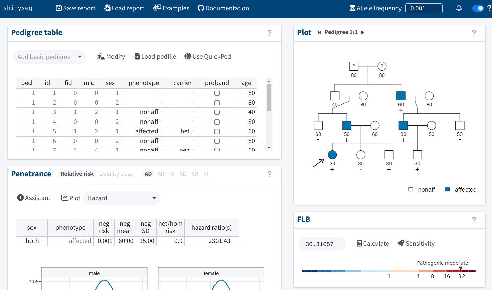

<!-- README.md is generated from README.Rmd. Please edit that file -->

# shinyseg

> ***Try it here***: [https://chrcarrizosa.shinyapps.io/shinyseg](https://chrcarrizosa.shinyapps.io/shinyseg).

shinyseg is an interactive web application for clinical cosegregation analysis, a method used to ascertain disease-associated genetic variants from family data. More specifically, it calculates the full-likelihood Bayes factor (FLB) for a variant's pathogenicity ([Thompson et al., 2003](https://doi.org/10.1086/378100)), which can be readily used within the ACMG-AMP framework for clinical variant interpretation ([Richards et al., 2015](https://doi.org/10.1038%2Fgim.2015.30); [Jarvik and Browning, 2016](https://doi.org/10.1016%2Fj.ajhg.2016.04.003)).

Analyses with shinyseg are easy and highly flexible. All you need to do is upload a pedigree file, enter the genetic/clinical data, and specify a suitable penetrance model. Discover more on the [**documentation website**](https://chrcarrizosa.github.io/shinyseg)!

