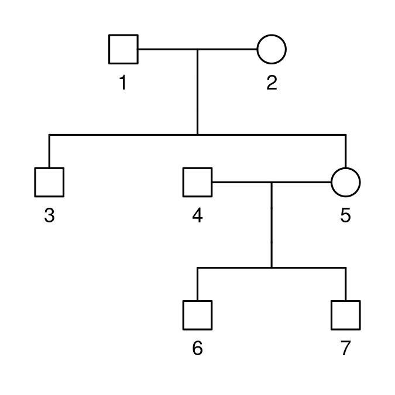
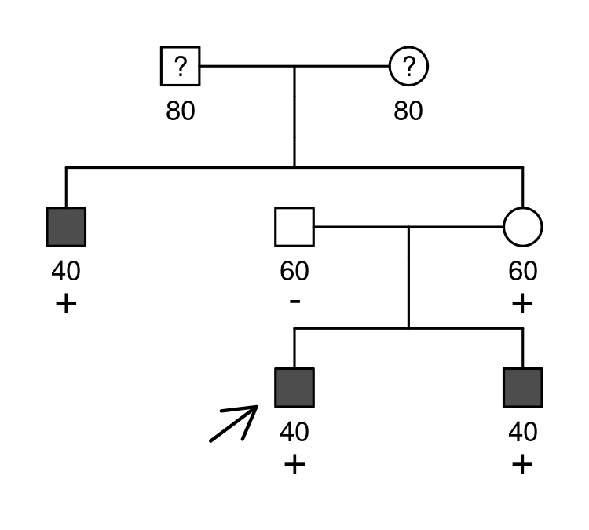

<!-- README.md is generated from README.Rmd. Please edit that file -->

# shinyseg

> ***Try it here***: <https://chrcarrizosa.shinyapps.io/shinyseg>.

## What is shinyseg?

shinyseg is an interactive web application for clinical cosegregation
analysis, a method used to ascertain disease-associated genetic variants
from family data. More specifically, it calculates the full-likelihood
Bayes factor (FLB) for a variant’s pathogenicity ([Thompson et al.,
2003](https://doi.org/10.1086/378100)), which can be readily used within
the ACMG-AMP framework for clinical variant interpretation ([Richards et
al., 2015](https://doi.org/10.1038%2Fgim.2015.30); [Jarvik and Browning,
2016](https://doi.org/10.1016%2Fj.ajhg.2016.04.003)).

Analyses with shinyseg are easy and highly flexible. All you need to do
is upload a pedigree file, enter the genetic/clinical data, and specify
a suitable penetrance model. The following sections briefly explain how
to do so with an example case (`Example 2`), but you can find detailed
guidance within the app.

shinyseg is powered by the [ped
suite](https://magnusdv.github.io/pedsuite/),
[Shiny](https://shiny.posit.co/), and
[rhandsontable](https://CRAN.R-project.org/package=rhandsontable).

## Uploading a pedigree

The application works with pedigree files in ped format, like those
created by [QuickPed](https://magnusdv.shinyapps.io/quickped). Here is
an example of such a file and the corresponding family:

     id fid mid sex
      1   0   0   1
      2   0   0   2
      3   1   2   1
      4   0   0   1
      5   1   2   2
      6   4   5   1
      7   4   5   1

Note that other columns may be present, but the app will only read: `id`
(individual ID), `fid` (father’s ID, 0 if not included in the pedigree),
`mid` (mother’s ID, 0 if not included in the pedigree), and `sex` (1 =
male; 2 = female).

## Genetic and clinical data

Once a pedigree is loaded, users are presented with a table to enter the
analysis data:

- **phenotype:** free-text field to specify disease phenotypes relevant
  to the analysis, e.g. `affected`, `breast cancer`, etc. `nonaff` for
  unaffected individuals, empty if unknown.
- **carrier:** `neg` for non-carriers, `het` for heterozygous (or
  hemizygous) carriers, `hom` for homozygous carriers. Empty if unknown.
- **proband:** checkbox indicating the proband or index case.
- **age:** integer between 1-100 specifying the age of disease onset or
  censoring.

For instance:

     id fid mid sex phenotype carrier proband age
      1   0   0   1                            80
      2   0   0   2                            80
      3   1   2   1  affected     het          40
      4   0   0   1    nonaff     neg          60
      5   1   2   2    nonaff     het          60
      6   4   5   1  affected     het       X  40
      7   4   5   1  affected     het          40

## Penetrance model

The inheritance pattern combines choices for chromosome (`A`: autosomal,
`X`: X-linked) and dominance (`D`: dominant, `R`: recessive, `I`:
incomplete). In this example we select X-linked recessive (`XR`), which
will adjust other inputs accordingly.

Next, it is time to assign the probabilities of observing the analysis
phenotypes conditional on carriership status. These will be hereafter
referred to as penetrances, and their specification may be done in two
ways:

### 1) Relative risk

A parametric version of the survival penetrances by [Belman et
al. (2020)](https://doi.org/10.1038/s41436-020-0920-4). It is based on:

- **Baseline lifetime risk, mean and SD:** the lifetime risk, mean, and
  standard deviation of disease onset in phenocopies, i.e. non-carriers
  and heterozygous carriers in recessive inheritance.
- **Hazard ratios:** the relative risks in homo-, hemi-, and
  heterozygous carriers in dominant inheritance, compared to
  phenocopies. They can be either constant or age-dependent and may also
  be specified through a **variant-associated lifetime risk**.

For example, the following describes a constant relative risk model in
which phenocopies have a lifetime risk of 0.01 (1%) with onset at 70±15
years of age, while hemizygous men and homozygous women have a lifetime
risk of 0.75 (75%).

                                                                  
                       neg/♀het              ♂het/hom       hazard
      sex  phenotype       risk  mu  sigma       risk     ratio(s)
     both   affected       0.01  70     15       0.75       137.93

To facilitate the specification, shinyseg can also optimize these
parameters based on user-provided cumulative incidence data.

### 2) Liability class

Alternatively, users can manually define the penetrances using a table.
The following represents the simplest case where there are no
phenocopies, and the chance of disease onset in hemizygous men and
homozygous women is 100%.

                                            
     neg/♀het ♂het/hom                      
         risk     risk  sex  phenotype  ages
         0.00     1.00                      

More detailed specifications, dependent on sex, phenotype, and age, can
be created by adding more rows and filling in these columns accordingly.

## Cosegregation evidence

Calculating the FLB is then as easy as clicking a button. For instance,
with a population variant frequency of `0.001` and the simple liability
class model from before, we get an `FLB = 8.00`. shinyseg reports this
as supporting evidence for pathogenicity based on [Jarvik and Browning’s
(2016)](https://doi.org/10.1016%2Fj.ajhg.2016.04.003) thresholds.

Afterward, the app opens up more possibilities, including downloading a
report with your results or performing sensitivity analyses to assess
their robustness. Explore all these features now with
[shinyseg](https://chrcarrizosa.shinyapps.io/shinyseg)!
