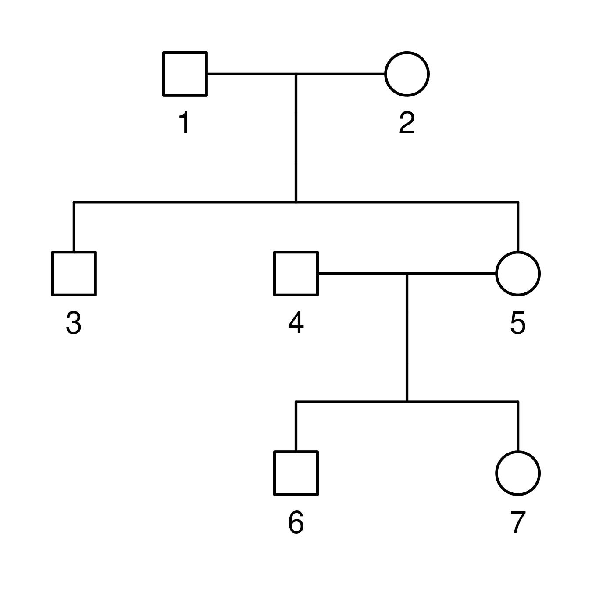
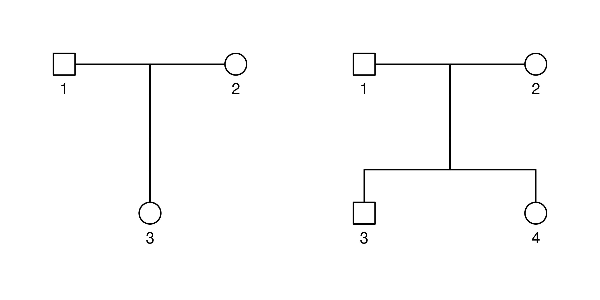
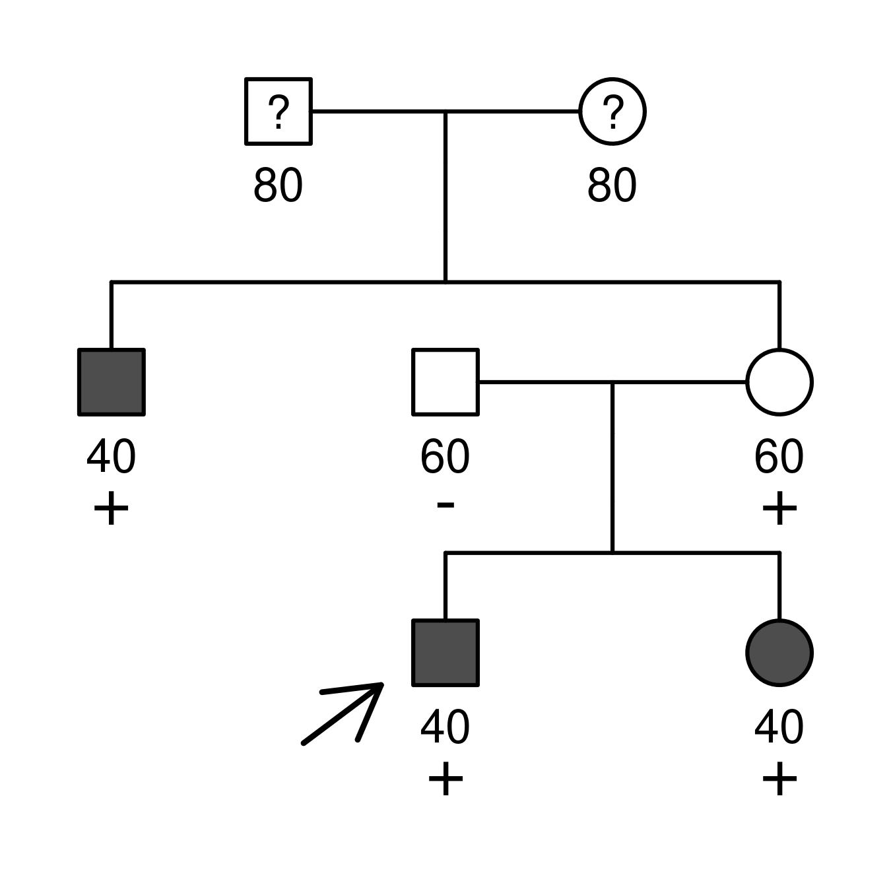

# The pedigree table {#the-pedigree-table}

The first step is to input the data for the analysis. You will need to
upload suitable pedigree file and specify who is affected, who is a
carrier, and who is the proband or index case. All these tasks are done
on the *Pedigree table* panel within the app.

## Uploading a pedigree {#uploading-a-pedigree}

shinyseg works with pedigree files in ped format, and you may upload
more than one and remove them at any time.

### The ped format {#the-ped-format}

A ped file encodes a family in a tabular structure with columns:

-   `id`: individual ID.
-   `fid`: father’s ID, 0 if not included in the pedigree.
-   `mid`: mother’s ID, 0 if not included in the pedigree.
-   `sex`: 1 = male; 2 = female.

Here is an example of such a file and the corresponding family:

``` text
 id fid mid sex
  1   0   0   1
  2   0   0   2
  3   1   2   1
  4   0   0   1
  5   1   2   2
  6   4   5   1
  7   4   5   2
```



If you need help creating the ped file, you can use
[QuickPed](https://magnusdv.shinyapps.io/quickped), which allows you to
do so in an interactive way.

Once ready, upload it by clicking on **Add pedfile**. Alternatively, the
dropdown menu on the left (**Add basic pedigree**) offers some basic
structures that may suit your analysis. If successful, you will see the
family data appearing on the pedigree table and also displayed on the
*Plot* panel to the right.

:::warning

You will not be able to do more until you add at least one family to the
analysis!

:::

### Multiple families {#multiple-families}

You can repeat this process to add more families; they will appear
concatenated in the pedigree table indexed by the `ped` column. However,
it is also possible to upload multiple pedigrees simultaneously if you
provide this column yourself. For instance:

``` text
 ped id fid mid sex
   1  1   0   0   1
   1  2   0   0   2
   1  3   1   2   2
   2  1   0   0   1
   2  2   0   0   2
   2  3   1   2   1
   2  4   1   2   2
```



When you have more than one family, you can choose which one to show on
the *Plot* panel using the directional buttons on its header. You may
remove the one currently on display by clicking on **Modify \> Remove
family** on the *Pedigree table* panel.

## Filling in the data {#filling-in-the-data}

To conduct the analysis, it is required to specify some additional data
about the families on the pedigree table. This may be done in-app or
together with the previous step.

### Clinical and genetic data {#clinical-and-genetic-data}

This refers to who is affected and of what, who is known to carry the
variant, who does not, etc… It is summarised on four columns:

-   **phenotype:** a free-text field to specify disease phenotypes
    relevant to the analysis, e.g., `affected`, `breast cancer`, etc.
    Use `nonaff` for unaffected individuals; leave empty if unknown.
-   **carrier:** use `neg` for non-carriers, `het` for heterozygous (or
    hemizygous) carriers, `hom` for homozygous carriers. Leave empty if
    unknown.
-   **proband:** a checkbox indicating the proband or index case.
-   **age:** an integer between 1-100 specifying the age of disease
    onset or censoring/last follow-up.

For instance, the following states that individuals 3, 6, and 7 had the
onset of a certain unspecified disease at 40 years of age. Conversely, 4
and 5 were unaffected by 60 years of age. Individuals 3, 5, 6 (proband),
and 7 carry one copy of the variant under study; 4 does not. For the
founders 1 and 2, only ages are known:

``` text
 id fid mid sex phenotype carrier proband age
  1   0   0   1                            80
  2   0   0   2                            80
  3   1   2   1  affected     het          40
  4   0   0   1    nonaff     neg          60
  5   1   2   2    nonaff     het          60
  6   4   5   1  affected     het       1  40
  7   4   5   2  affected     het          40
```



You can find more cases on the [Examples](/examples/) section.

:::important

For each family, ensure you have:

-   1 or more disease phenotypes.
-   1 or more variant carriers.
-   1 proband, who should be both affected and carrier.
-   No missing ages.

:::

### Extended ped file {#extended-ped-file}

Introducing all this information can be tedious if there are many family
members. However, you can skip doing this in-app if you already provide
some of the additional columns with the ped file. For example, try to
copy the previous code block and upload it via **Add pedfile**.

Note that shinyseg will check the uploaded data and may remove part of
it if they have been wrongly specified.

